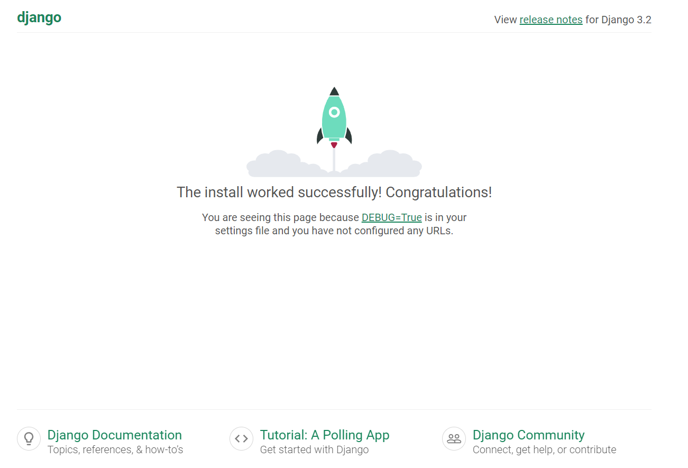

# Django 개발 환경 설정 가이드

- 가상환경 생성/ 실행
  - 바탕 화면에서 git bash 실행
  - 프로젝트 진행할 폴더로 이동
  - 프로젝트 진행 파일 생성

```bash
holho@DESKTOP-7SL46VG MINGW64 ~/OneDrive/DeskTop
$ cd

holho@DESKTOP-7SL46VG MINGW64 ~
$ mkdir test

holho@DESKTOP-7SL46VG MINGW64 ~
$ cd test
```

- 가상환경 생성 진행
  - 가상환경 실행

```bash
holho@DESKTOP-7SL46VG MINGW64 ~/test
$ python -m venv test-venv             # 가상 환경 생성

holho@DESKTOP-7SL46VG MINGW64 ~/test
$ source test-venv/Scripts/activate         #가상 환경 실행

(test-venv)
holho@DESKTOP-7SL46VG MINGW64 ~/test        # 가상환경 실행 종료
$ deactivate

holho@DESKTOP-7SL46VG MINGW64 ~/test
$ source test-venv/Scripts/activate

(test-venv)
holho@DESKTOP-7SL46VG MINGW64 ~/test

```

- 가상환경안에 django 설치 확인
- 없다면 설치 진행

```bash
holho@DESKTOP-7SL46VG MINGW64 ~/test
$ pip list
Package    Version
---------- -------
pip        22.0.4
setuptools 58.1.0

holho@DESKTOP-7SL46VG MINGW64 ~/test
$ pip install django==3.2.13
Collecting django==3.2.13
  Using cached Django-3.2.13-py3-none-any.whl (7.9 MB)
Collecting sqlparse>=0.2.2
  Using cached sqlparse-0.4.2-py3-none-any.whl (42 kB)
Collecting pytz
  Using cached pytz-2022.2.1-py2.py3-none-any.whl (500 kB)
Collecting asgiref<4,>=3.3.2
  Using cached asgiref-3.5.2-py3-none-any.whl (22 kB)
Installing collected packages: pytz, sqlparse, asgiref, django

holho@DESKTOP-7SL46VG MINGW64 ~/test
$ pip list
Package    Version
---------- --------
asgiref    3.5.2
Django     3.2.13
pip        22.0.4
pytz       2022.2.1
setuptools 58.1.0
sqlparse   0.4.2

```

- django 이용 프로젝트 서버 생성

```bash
(test-venv)
holho@DESKTOP-7SL46VG MINGW64 ~/test
$ django-admin startproject testpjt .
(test-venv)

holho@DESKTOP-7SL46VG MINGW64 ~/test
$ python manage.py runserver
Watching for file changes with StatReloader

```

- 서버 생성후 생성 확인

[](http://localhost:8000/)


# 서버 기초

### IP와 도메인은 무엇일까요?

컴퓨터에 메세지를 보내기 위해 메시지를 받을 특정 컴퓨터를 지저하기 위해 네트워크에 연결된 컴퓨터의 고유한 주소 (ip는 인터넷 프로토콜을 나타냄)

도메인은 이러한 IP주소를 사람들이 좀 더 쉽게 기억할 수 있게 IP주소의 이름을 지정하는 것 예를 들어   도메인   ` 'google.com'`은 IP 주소로 `'173.194.121.32'` 이다.


### 클라이언트와 서버란?

웹에 연결된 컴퓨터는 클라이어트와 서버라고 한다.

- 클라이언트는 일반적인 웹 사용자의 인터넷이 연결된 장치들과 이런 장치들에서 이용가능한 웹에 접근하는 소트트웨어이다.
- 서버는 웹페이지, 사이트 또는 앱을 저장하는 컴퓨터, 클라이언트의 장비가 웹페이지에 접근하길 원할 때,  서버로부터 클라이어트의 장치로 사용자의 웹 브라우저에서 보여지기 위한 웹페이지의 사본이 다운로드 됨

- 오직 클라이언트만이 HTTP 요청을 만들 수 있으며, 서버에게만 보낼 수 있음. 서버는 오직 클라이언트의 HTTP 요청에 응답가능
- HTTP를 통해 파일을 요청할때, 클라이언트는 반드시 [URL](https://developer.mozilla.org/ko/docs/Glossary/URL) 파일들을 제공해야 한다.
- 웹 서버는 반드시 최소한의 에러 메시지를 포함하여 모든 HTTP 요청에 응답해야 한다.


### 정적 웹사이트와 동적 웹사이트의 차이는 무엇일 까요?

- 정적 웹 서버 혹은 스택은 HTTP 서버 (소프트웨어)가 있는 컴퓨터(하드웨어)로 구성되어 있습니다. 서버가  불려진 파일을 당신의 브라우저에게 전송하기 때문에, '정적'이라고 표현된다.

- 동적 웹 서버는 정적 웹 서버와 추가적인 소프트웨어(대부분 일반적인 애플리케이션 서버와 데이터베이스)로 구성되어 있습니다. 애플리케이션 서버가 HTTP 서버를 통해 당신의 브라우저에게 불려진 파일들을 전송하기 전에, 애플리케이션 서버가 업데이트하기 때문에 우리는 이것을 동적이라고 부릅니다.

대략적으로 말하자면, 서버는 정적 혹은 동적 컨텐츠 모두 제공할 수 있습니다. "정적"은 "있는 그대로 제공되는 것(served as-is)"를 의미, "동적"은 서버가 컨텐츠를 처리하는 것, 심지어는 컨텐츠를 데이터베이스로부터 생성하는 것을 의미한다. 이 방법은 더 많은 유연성을 제공하지만, 기술적 스택이 더 다루기 힘들어지고, 웹사이트를 구축하는 것이 훨씬 더 복잡해진다.

- 정적 웹사이트
  - 정적 사이트는 특별한 리소스 요청이 들어올 때 서버에서 하드 코딩된 동일한 콘텐츠를 반환합니다.
  - 사용자가 페이지를 탐색하거나, 브라우저가 지정된 URL에 HTTP 'get' 요청을 보낼 때 서버는 파일 시스템에서 요청한 문서를 검색하고 문서와 success status(보통 200 ok)를 포함한 HTTP응답을 반환
- 동적 웹사이트
  - 동적 웹사이트는 필요할 때에 동적으로 응답 콘텐츠가 생성 된다. 동적 웹사이트의 웹 페이지는 보통 HTML 템플릿에 있는 자리 표시자에 데이터베이스에서 가져온 데이터를 넣어 생성 됩니다. 이러한 방법은 많은 양의 콘텐츠를 저장하기에 정적 웹 사이트를 이용하는 것보다 효과적
  - 동적 웹사이트는 사용자 또는 저장된 환경을 기반으로 URL에 대해 다른 데이터를 반환 할 수 있으며, 응답을 반환하는 과정에서 다른 작업을 수행 할 수 있다.
  - 동적 웹사이트를 지원하는 코드는 서버에서 실행 되어야 합니다. 이러한 코드를 만드는 것은 "**server-side programming**"이라고 알려있으며,  (또는 "**back-end scripting**"이라고 불리기도 합니다).


### HTTP는 무엇이고 요청과 응답 메시지 구성은 어떻게 되나요?


- HTTP는 클라이언트-서버 프로토콜입니다. 요청은 하나의 개체, 사용자 에이전트(또는 그것을 대신하는 프록시)에 의해 전송됩니다. 대부분의 경우, 사용자 에이전트는 브라우저지만, 무엇이든 될 수 있습니다. 
- 각각의 개별적인 요청들은 서버로 보내지며, 서버는 요청을 처리하고 *response*라고 불리는 응답을 제공합니다. 이 요청과 응답 사이에는 여러 개체들이 있는데, 예를 들면 다양한 작업을 수행하는 게이트웨이 또는 [캐시](https://developer.mozilla.org/ko/docs/Glossary/Cache) 역할을 하는 [프록시](https://developer.mozilla.org/ko/docs/Glossary/Proxy_server) 등이 있습니다.
- 클라이어튼-서버 프로토콜이란 (보통 웹브라우저인) 수신자 측에 의해 요청이 초기화되는 프로토콜을 의미, 하나의 완전한 문서는 텍스트, 레이아웃 설명, 이미지, 비디오, 스크립트 등 불러온 하위 문서들로 재구성 된다.
- HTTP 메시지
  - HTTP/1.1와 초기 HTTP 메시지는 사람이 읽을 수 있습니다. HTTP/2에서, 이 메시지들은 새로운 이진 구조인 프레임 안으로 임베드 되어, 헤더의 압축과 다중화와 같은 최적화를 가능케 합니다. 본래의 HTTP 메시지의 일부분만이 이 버전의 HTTP 내에서 전송된다고 할지라도, 각 메시지의 의미들은 변화하지 않으며 클라이언트는 본래의 HTTP/1.1 요청을 재구성 합니다
  - HTTP 메시지의 두가지 타입인 요청과 응답은 각자가의 특성있는 형식을 가지고 있습니다.
  - 요청
    - HTTP 메서드, 보통 클라이언트가 수행하고자 하는 동작을 정의한 GET,POST 같은 동사나 OPTIONS 나 HEAD와 같은 명사입니다. 일반적으로, 클라이언트는 리소스를 가져오거나(GET 이용) HTML 폼의 데이터를 전송(POST를 이용)하지만 다른경우에 다른 동작이 요구 된다.
    - 가져오려는 리소스의 경로; 예를 들면 [프로토콜](https://developer.mozilla.org/ko/docs/Glossary/Protocol) (`http://`), [도메인 (en-US)](https://developer.mozilla.org/en-US/docs/Glossary/Domain) (여기서는 `developer.mozilla.org`), 또는 TCP [포트 (en-US)](https://developer.mozilla.org/en-US/docs/Glossary/Port) (여기서는 `80`)인 요소들을 제거한 리소스의 URL입니다.
  - 응답 
    - HTTP 프로토콜의 버전.
    - 요청의 성공 여부와, 그 이유를 나타내는 상태 코드
    - 아무런 영향력이 없는, 상태 코드의 잛은 설명을 나타내는 상태 메시지.
    - 요청 헤더와 비슷한, HTTP 헤더들.
    - 선택 사항으로, 가져온 리소스가 포함되는 본문.

### 프레임 워크란?

- 일정한 형태의 틀, 부품을 가지고 다양한 형태의 결과물을 만드는 것! 
- '제공받은 일정한 요소와 틀, 규약을 가지고 무언가를 만드는 일'
- 소프트웨어에서 프레임워크는 어떤 프로그램을 쉽게 만들기 위한 요소와 룰을 제공해 줌으로서 소프트웨어의 생산성과 품질을 높이는 역활을 하는 것 
- 결론적으로 '특정 프로그램을 개발하기 위한 여러 요소들과 메뉴얼인 룰을 제공하는 프로그램'

- 장고 프레임워크

​	장고프레임워크란 파이썬으로 작성된 오픈 소스 웹 애플리케이션 프레임워크로 쉽고 빠르게 웹사이트를 개발할 수 있도록 돕는 구성요	소로 이루어져 있습니다. 파이썬 프로그래밍 자체가 다른 프로그래밍에 비해 배우기 쉽고 쓰기 편하게 되어 있기 때문에 개발기간을 상	당히 단축시킬 수 있습니다.

​	장고프레임워크는 그에 수반되는 강력한 라이브러리들을 그대로 사용할 수 있다는 점이 가장 큰 장점이라고 볼 수 있습니다.

- **장고프레임워크** **특징**

  - MVC 패턴 기반 MTV (기본적으로 Model-View-Controller 를 기반으로 한 프레임워크)

  - ORM(Object-relational mapping) 기능 지원

  - 쉬운 DB관리를 위해 프로젝트를 생성하면서 관리자기능을 제공

  - 쉬운 URL 파싱 기능 지원

  - 동일한 소스코드에서 다른 나라에서 용이하도록 번역, 날짜/시간/숫자 등의 포맷 타임존 지정 등의 기능을 제공


개발자는 일반적으로 **web frameworks**를 이용하여 코드를 작성 합니다. 웹 프레임 워크는 일반적인 문제를 해결하고 개발 속도를 높이며 특정 도메인에서 직면하는 다양한 유형의 작업을 단순화하도록 설계된 함수, 객체, 규칙 및 기타 코드 구성 요소의 모음입니다. 다시 말하지만 클라이언트와 서버 측 코드 모두 프레임 워크를 사용하지만 도메인은 매우 다르므로 프레임 워크도 다릅니다. 클라이언트 측 웹 프레임 워크는 레이아웃 및 프리젠 테이션 작업을 단순화하는 반면 서버 측 웹 프레임 워크는 직접 구현해야하는 많은 "공통"웹 서버 기능을 제공합니다(예: 세션 지원, 사용자와 인증을 지원, 데이터베이스와 쉬운 연결, 템플리트 라이브러리, 기타 등등.).
