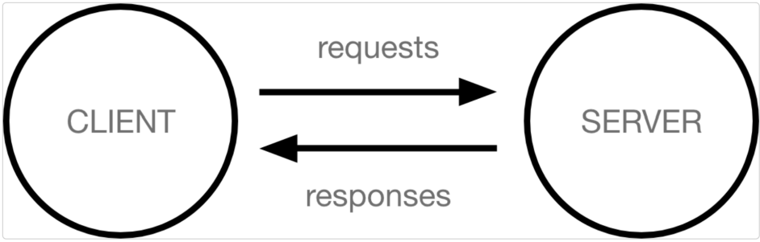

# Django 시작하기

## Framework 이해하기

- 코드를 재사용하는 것은 이미 익숙한 개발 문화
- '웹 서비스'도 누군가 개발해 놓은 코드를 재사용하면 된다
- 전 세계의 수많은 개발자들이 이미 수없이 많이 개발해 봤고, 그 과정에서 자주 사용되는 부분들을 재사용 할 수 있게 좋은 구조의 코드로 만들어 두었음
- 그러한 코드들을 모아 놓은것, 즉 서비스 개발에 필요한 기능들을 미리 구현해서 모아 놓은 것 = 프레임 워크(Framework)
- Frame(뼈대, 틀) + Work(일하다)
  - 일정한 뼈대, 틀을 가지고 일하다
  - 제공받은 도구들과 뼈대, 규약을 가지고 무언가를 만드는 일
  - 특정 프로그램을 개발하기 위한 여러 도구들과 규약을 제공하는 것
- '소프트웨어 프레임 워크'는 복잡한 문제를 해결하거나 서술하는 데 사용되는 기본 구조
- 따라서 간편하게 내가 만들고자 하는 본질(로직)에 집중해 개발 할 수 있음
- 소프트 웨어의 생산성과 품질을 높임

## web 이해하기

- 인터넷이란?
  - 우리가 구글에 접속할 때
    - 웹 브라우저를 켠다
    - 주소창에 주소를 입력한다(www.google.com)
  - www, 즉 World Wide Web은 '전 세계에 퍼져있는 거미줄 같은 연결망'

## 클라이언트와 서버

- 오늘날 우리가 사용하는 대부분의 웹 서비스는 클라이어트 - 서버 구조를 기반으로 동작
- 클라이언트와 서버 역시 하나의 컴푸터이며 이들이 어떻게 상효작용하는지에 대한 간소화된 다이어그램

- 클라이어트
  - 웹 사용자의 인터넷에 연결된 장치(예를 들어 wi-fi에 연결된 컴퓨터 또는 모바일)
  - Chrome 또는 Firefox와 같은 웹 브라우저
  - 서비스를 요청하는 주체
- 서버
  - 웹 페이지, 사이트 또는 앱을 저장하는 컴퓨터
  - 클라이언트가 웹 페이지에 접근하려고 할 때 서버에서 클라이언트 컴포터로 웹 페이지 데이터를 응답해 사용자의 웹 브라우저에 표시됨
  - 요청에 대해 서비스를 응답하는 주체

### 정리

- 우리가 사용하는 웹은 클라이언트-서버 구조로 이루어져 있음
- 앞으로 우리가 배우는 것도 이 클라이언트 - 서버구조를 만드는 방법을 배우는 것
- 이중에서 Django는 서버를 구현하는 웹 프레임 워크

## Web browser 와 Web Page

- 웹에서 페이지를 찾아 보여주고, 사용자가 하이퍼링크를 통해 다른 페이지로 이동할 수 있도록 하는 프로그램
- 웹 페이지 파일을 우리가 보는 화면으로 바꿔주는(렌더링, rendering) 프로그램
- 즉,  웹 페이지 코드를 받으면 우리가 보는 화면처럼 바꿔주는 것이 바로 웹 브라우저

### 정적 웹페이지

- Static Web page
- 있는 그래도를 제공하는 것(serverd as -is)을 의미
- 우리가 지금까지 작성한 웹 페이지이며 한 번 작성된 HTML 파일의 내용이 변하지 않고 모든 사용자에게 동일한 모습으로 전달되는 것
  - == 서버에 저장된 HTML 파일 그래도 전달된 웹페이지
  - == 같은 상황에서 모든 사용자에게 동일한 정보를 표시

### 동적 웹페이지

- Dynamic Web page
- 사용자의 요청에 따라 웹 페이지에 추가적인 수정이 되어 클라이언트에게 전달되는 웹 페이지
- 웹 페이지의 내용을 바꿔주는 주체 == 서버
  - 서버에서 동작하고 있는 프로그램이 웹 페이지를 변경해줌 이렇게 사용자의 요청을 받아서 적절한 응답을 만들어주는 프로그램을 쉽게 만들 수 있게 도와주는 프레임워크가 바로 우리가 배울 Django
- 다양한 서버 사이드 프로그래밍 언어(python, java, c++등) 사용 가능 파일을 처리하고 데이터베이스와의 상효작용이 이루어짐
- 이 중에서 Python을 이용해서 개발할 수 있는 프레임워크인 Django를 학습하는 것

## Django 구조 이해가기( MTV Design Pattern)

- Design Pattern 이란?
  - 소프트웨어에서의 관점
    - 각기 다른 기능을 가진 다양한 응용 소프트웨어를 개발할 때 공통적인 설계 문제가 존재하며, 이를 처리하는 해결책 사이에도 공통점이 있다는 것을 발견
    - 이러한 유사점을 패턴이라 함

### 소프트웨어 디자인 패턴

- 소프트웨어도 수십년간 전 세계의 개발자들이 계속 만들다 보니 자주 사용되는 구조와 해결책이 있다는 것을 알게 됨
- 앞서 배웠던 클라이언트-서버 구조도 소프트웨어 디자인 패턴 중 하나
- 자주 사용되는 소프트웨어의 구조를 소수의 뛰어난 엔지니어가 마치 건축의 공법처럼 일반적인 구조화를 해둔것
- 소프트웨어 디자인 패턴의 목적
  - 특정 문맥에서 공통적으로 발생하는 문제에 대해 재사용 가능한 해결책을 제시
  - 프로그래머가 어플리케이션이나 시스템을 디자인할 때 발생하는 공통된 문제들을 해결하는데 형식화 된 가장 좋은 관행

### Django 에서의 디자인 패턴

- Django에도 이러한 디자인 패턴이 적용이 되어 있는데, Django에 적용된 디자인 패턴은 MTV 패턴이다.
- MTV 패턴은 MVC 디자인 패턴을 기반으로 조금 변형된 패턴이다.

### MVC 소프트웨어 디자인 패턴

- MVC는 Model-View-Controller의 준말 데이터 및 논리 제어를 구현하는데 널리 사용되는 소프트웨어 디자인 패턴
- 하나의 큰 프로그램을 세가지 역활로 구분한 개발 방법론
- Model : 데이터와 관련된 로직을 관리
- View : 레이아웃과 화면을 처리
- Controller : 명령을 model과 view 부분으로 연결

### MVC 소프트웨어 디자인 패턴의 목적

- '관심사 분리'
- 더 나은 업무의 분리와 향상된 관리를 제공
- 각 부분을 독립적으로 개발할 수 있어, 하나를 수정하고 싶을 때 모두 건들지 않아도 굄
  - == 개발 효율성 및 유지보수가 쉬워짐
  - == 다수의 멤버로 개발하기 용이함

### MTV 디자인 패턴

- Model
  - MVC 패턴에서 Model의 역활에 해당
  - 데이터와 관련된 로직을 관리
  - 응용프로그램의 데이터 구조를 정의하고 데이터베이스의 기록을 관리
- Template
  - 레이아웃과 화면을 처리
  - 화면상의 사용자 인터페이스 구조와 레이아웃을 정의
  - MVC 패턴에서 View의 역활에 해당
- View
  - Model & Template과 관련한 로직을 처리해서 응답을 반환
  - 클라이언트의 요청에 대해 처리를 분기하는 역활
  - 동작 예시
    - 데이터가 필요하다면 model에 접근해서 데이터를 가져오고, 가져온 데이터를 template로 보내 화면을 구성하고 구성된 화면을 응답으로 만들어 클라이언트에게 반환
  - MVC 패턴에서 Controller의 역활에 해당

## 장고 기본 설정

