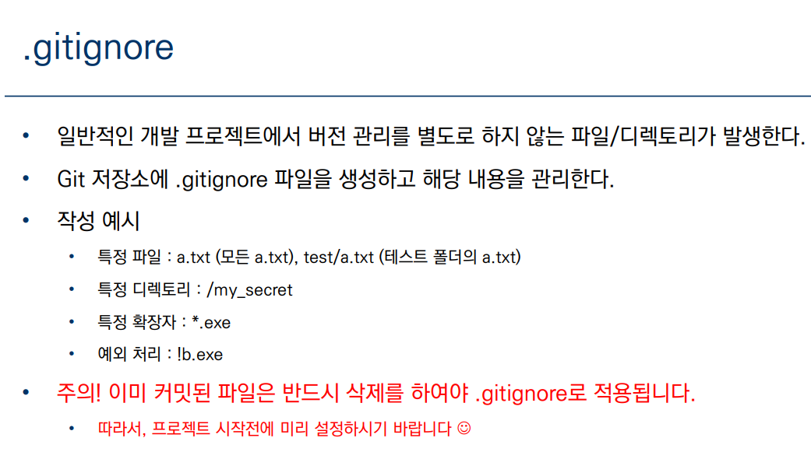

# 원격 저장소 활용하기

## 분산버전관리시스템(DVCS)

- 분산버전관리시스템은 원격 저장소(remote repository)를 통하여 협업하가고, 모든 히스토리를 클라이언트들이 공유.

## 원격저장소(Remote Repository)

- GitHub
- GitLab
- Bitbucket

Git은 버전(커밋)을 관리한다.

원격저장소를 만들고, 로컬저장소의 커밋을 push 한다.

### 원격저장소 경로 설정

- 원격 저장소 정보를 로컬 저장소에 추가
- 로컬 저장소에는 한번만 설정 해주면 된다.

​		`$ git remote add origin http://github.com/suyoung049/TIL.git`

- 원격저장소 정보 확인
  - `$ git remote -v`

### 원격저장소 활용 명령어 -`push`

`$ git push(원격저장소이름)(브랜치 이름)`

- 원격저장소로 로컬 저장소 변경 사항(커밋)을 올림 < push >
- 로컬 폴더의 파일/폴더가 아닌 저장소의 버전(커밋)이 올라감

1. 로컬에서만 편집(수정,삭제,생성)
2. 작업전에 `$ git pull origin master`

### 원격저장소 활용 명령어 -`pull`

$ git pull<원격저장소이름><브랜치이름>

- 원격저장소 업데이트된 커밋 가져오기

### 원격저장소 활용 명령어 - `clone`

- 원격 저장소를 복제하여 모든 버전을 가져옴
- 원격 저장소 이름의 폴더를 이동해서 활용함

#### clone과 pull의 차이점은 ?

clone : 원격저장소 복제

pull : 원격저장소 커밋 가져오기

#### 원격저장소 설정 기본 명령어

| 명령어                               | 내용                               |
| ------------------------------------ | ---------------------------------- |
| git clone < url >                    | 원격 저장소 복제                   |
| git remote add < 원격저장소 >< url > | 원격저장소 추가(일반적으로 origin) |
| git remote rm <원격저장소 >          | 원격저장소 삭제                    |
| git remot -v                         | 원격저장소 정보 확인               |
| git push < 원격저장소 >< 브랜치>     | 원격저장소에 push                  |
| git pull < 원격저장소 >< 브랜치>     | 원격저장소에 pull                  |

## `.gitignore`

### gitigoner 참고 사이트
- [http://gitignore.io](http://gitignore.io)

