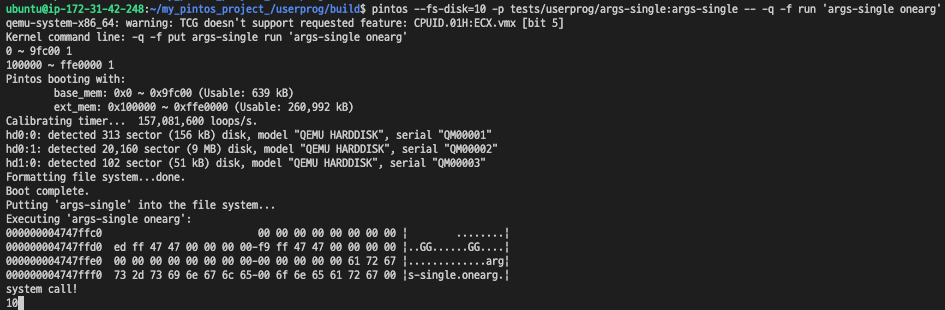

### 1.Pintos 부팅 ~ 파일 실행 전 까지

```c
pintos --fs-disk=10 -p tests/userprog/args-single:args-single -- -q -f run 'args-single onearg'
```



##### 1. qemu 에뮬레이터 실행: qemu-system-x86_64

코드를 입력하면 가장 먼저 실행 되는건 qeum-system-x86 64이다. 이는 에뮬레이터로, 우리가 빌린 리눅스 컴퓨터 내에서 또 하나의 OS인 pintos를 띄우기 위해 가상화를 지원하는 에뮬레이터라고만 알면 된다


##### 2. int main() 실행 : kernel command line:  -q -f put args-single run 'args-single onearg'

에뮬레이터가 실행되고 나면 곧바로 Pintos 부팅 시작, Pintos 부팅은 init.c를 실행하면서 시작 int main()

```c
int
main (void) {
	uint64_t mem_end;
	char **argv;

	/* Clear BSS and get machine's RAM size. */
	bss_init ();

	/* Break command line into arguments and parse options. */
	argv = read_command_line ();
	argv = parse_options (argv);

	/* Initialize ourselves as a thread so we can use locks,
	   then enable console locking. */
	thread_init ();
	console_init ();

	/* Initialize memory system. */
	mem_end = palloc_init ();
	malloc_init ();
	paging_init (mem_end);

#ifdef USERPROG
	tss_init ();
	gdt_init ();
#endif

	/* Initialize interrupt handlers. */
	intr_init ();
	timer_init ();
	kbd_init ();
	input_init ();
#ifdef USERPROG
	exception_init ();
	syscall_init ();
#endif
	/* Start thread scheduler and enable interrupts. */
	thread_start ();
	serial_init_queue ();
	timer_calibrate ();

#ifdef FILESYS
	/* Initialize file system. */
	disk_init ();
	filesys_init (format_filesys);
#endif

#ifdef VM
	vm_init ();
#endif

	printf ("Boot complete.\n");

	/* Run actions specified on kernel command line. */
	run_actions (argv);

	/* Finish up. */
	if (power_off_when_done)
		power_off ();
	thread_exit ();
}
```

위에서 argv = read_command_line()이라는 코드가 있는데, 이 read_command_line() 함수 에서 우리가 입력한 input 코드를 읽어들인 다음 *kernel command line: -q -f put args-single run 'args-single onearg'* 를 출력한다. 여기서 parsing은 우리가 raw하게 입력한 명령어에서 실제 필요한 부분만 잘라내는 역활

이 read_command_line()에 가보면 ptov라는 매크로가 있는데, 애의 역활은 물리 주소를 가상 주소로 변환하는 역활이다. 보는 것처럼 물리주소에 KERN_BASE만 큼 더해서 가상주소로 변경

```c
#define ptov(paddr) ((void *) (((uint64_t) paddr) + KERN_BASE))
```


##### 3. thread_init() 실행 : main thread 실행

스레드를 초기화하는 함수. 여기서 main 스레드가 실행된다. 코드를 보자. "main" 이라는 이름을 인자로 넣어 init_thread()가 실행되는 것을 볼 수 있다. init_thread()에서는 해당 스레드에 메모리를 세팅해주고 스레드 구조체 내 interrupt frame 멤버에 해당하는 tf의 하위 멤버 이  rsp에 커널 스택 포인터 위치를 저장한다. 현재 t는 스택의 가장 아래 위치를 나타낸다. 여기에 paze size-sizeof(void*)를 계산하면 스택의 가장 끝 영역을 가리키는데 여기가 커널 스택 포인터의 위치이다. 여기서의 스택은 main 스레드이ㅡ 커널 스택에 해당한다. 왜 이값을 rsp에 저장하는지는 이 부분은 아래 tss를 설명할 때 나온다.


```c
void thread_init(void)
{
	ASSERT(intr_get_level() == INTR_OFF);

	/* Reload the temporal gdt for the kernel
	 * This gdt does not include the user context.
	 * The kernel will rebuild the gdt with user context, in gdt_init (). */

	/* Set up a thread structure for the running thread. */
	initial_thread = running_thread();
	init_thread(initial_thread, "main", PRI_DEFAULT);
	initial_thread->status = THREAD_RUNNING;
	initial_thread->tid = allocate_tid();
}

static void
init_thread(struct thread *t, const char *name, int priority)
{
	ASSERT(t != NULL);
	ASSERT(PRI_MIN <= priority && priority <= PRI_MAX);
	ASSERT(name != NULL);

	memset(t, 0, sizeof *t);
	t->status = THREAD_BLOCKED;
	strlcpy(t->name, name, sizeof t->name);
	t->tf.rsp = (uint64_t)t + PGSIZE - sizeof(void *);
	t->priority = priority;
	t->init_priority = priority;
	t->magic = THREAD_MAGIC;
	t->wait_lock = NULL;
	t->running_file = NULL;
	list_init(&t->donors);
```


##### 4. palloc_init() 실행

명령어를 읽어들이는 작업을 하고 나면 각종 초기화 세팅을 해주는 작업을 거친다. 스레드 부터 시작해서 콘솔, malloc 초기화를 거치면 다음에 페이지 할당 초기화 작업을 수행한다.

```c
uint64_t
palloc_init (void) {
  /* End of the kernel as recorded by the linker.
     See kernel.lds.S. */
	extern char _end;
	struct area base_mem = { .size = 0 };
	struct area ext_mem = { .size = 0 };

	resolve_area_info (&base_mem, &ext_mem);
	printf ("Pintos booting with: \n");
	printf ("\tbase_mem: 0x%llx ~ 0x%llx (Usable: %'llu kB)\n",
		  base_mem.start, base_mem.end, base_mem.size / 1024);
	printf ("\text_mem: 0x%llx ~ 0x%llx (Usable: %'llu kB)\n",
		  ext_mem.start, ext_mem.end, ext_mem.size / 1024);
	populate_pools (&base_mem, &ext_mem);
	return ext_mem.end;
}
```

우리가 쓸 수 있는 메모리(base memory, external memory)가 얼마나 되는지 표시해준다.


##### 5. tss_init()실행

tss_init()을 실행하는데, tss는 task-state sement를 뜻한다. 여기서 task라는 개념이 나오는데, task는 프로세서가 수행하는 작업의 최소 단위를 뜻한다. task는 곧 process이자  thread가  될 수도 있는데 인터럽트 혹은  exception 핸들러, 커널 등의 OS 서비스 작업을 수행하는데 사용한다. 이 task는 두가지 파트로 구성되어 있는데, 하나는 태스크 수행 공간(task execution space)으로, 태스크 역시 코드/데이터/스텍 세그먼트를 가진다. 그리고 이 태스크의 상태를 관리하는 세크먼트가 하나 더 있는데, 그게 tss이다. tss는 예전(x86 32)에는 task switching이라고 해서 작업 간 switching을 수행 할 때 사용 되었다. 하지만 여기 x86 64에서는 task switching이 사용되지 않는다고 한다. context switching이 이미 이 역활을 해 주고 있기 때문이다. 

###### x86 64에서 tss의 역활은 무엇일까?

> "TSS(Task-State Segement)는 아키텍쳐 task swithcing에 사용되었습니다. 그러나 x86-64에서는 task switching이 더 이상 사용되지 않습니다. 그럼에도 불구하고 TSS는 링 스위칭 동안 스택 포인터를 찾기 위해 여전히 존재합니다."
>
> 이것은 사용자 프로세스가 인터럽트 핸들러에 들어갈 때 하드웨어가 커널의 스택 포인터를 찾기 위해 tss를 참조한다는 것을 의미합니다.


##### 6. fsutil_put() 실행 : putting 'args-single' into the file system

하드 디스크 내 파일 시스템에 명령어를 복사해서 넣어준다 정도로 이해


##### 7. run_atcion() -> run_task() 실행 : Executing 'args-single onearg'

대망의 run_task()를 실행한다. 인자로 들어가는  값(args-single onearg)을 보면 알겠지만 그 전까지 입력해줬던 값은 이미 parsing되어 잘려 나갔다

```c
static void
run_task (char **argv) {
	const char *task = argv[1];

	printf ("Executing '%s':\n", task);
#ifdef USERPROG
	if (thread_tests){
		run_test (task);
	} else {
		process_wait (process_create_initd (task));
	}
#else
	run_test (task);
#endif
	printf ("Execution of '%s' complete.\n", task);
}
```

여기서 process_create_initd()를 실행해 우리가 입력해준 'args-single onearg'에 대한 프로세스를 생성한다. 이어서 process_wait()으로 변환값이 인자로 들어가며 대기한다. 이 때 들어가는 인자 task는 argv[1] = 'args-single onearg'이다. argv[0]은 무엇인가 찍어보니 "run"이었다.

여기서 wait()를 통해 무한 대기 루프로 들어가는데, 우리는 이전에 timer_init()으로 타이머 인터럽트를 초기화해줬다. 정해진 시간 동안 기다리다가 타이머가 작동하면 initial 스레드에서 우리가 실행하고자 하는 사용자 프로세스에 대응하는 커널 스레드(아직 운영체제가 cpu를 잡고 있는 것은 동일)로 프로세스가 switch된다.당연히 내부레지스터 역시 main 스레드 내용에서 args 커널 스레드로 변경(context swithcing)


##### 8. process_create_initd() -> tinitd() 실행 : 첫 유저 프로세스 실행

여기서 'args-single onearg'에 대한 프로세스를 생성하는데, thread_create()에서 initd()를 실행하고 해당 파일 이름으로 스레드를 생성한다 initd()는 첫번째 유저 프로세스를 실행하는 함수이다. 왜 첫 번째라고 명시하냐면, 그 다음부터는 fork()를 통해 프로세스를 생성하면 되기 때문에 첫 프로세스를 생성할 때만 initd()를 사용한다. initd()에서는 process_init()에 이어 process_exec()를 실행한다.

```c
tid_t process_create_initd(const char *file_name)
{
	char *fn_copy;
	tid_t tid;

	/* Make a copy of FILE_NAME.
	 * Otherwise there's a race between the caller and load(). */
	fn_copy = palloc_get_page(0);
	if (fn_copy == NULL)
		return TID_ERROR;
	strlcpy(fn_copy, file_name, PGSIZE);

	/* Create a new thread to execute FILE_NAME. */
	char *tmp;
	file_name = strtok_r(file_name, " ", tmp);
	tid = thread_create(file_name, PRI_DEFAULT, initd, fn_copy);
	if (tid == TID_ERROR)
		palloc_free_page(fn_copy);
	return tid;
}

/* A thread function that launches first user process. */
static void
initd(void *f_name)
{
#ifdef VM
	supplemental_page_table_init(&thread_current()->spt);
#endif

	process_init();

	if (process_exec(f_name) < 0)
		PANIC("Fail to launch initd\n");
	NOT_REACHED();
}

```


##### 9. process_exec()실행

argument pasing 및 유저 커널 스택에 정보를 올리는 작업(load)을 수행한다. 이 작업을 수행하는 주체 역시도 커널 스레드라는 점을 헷갈리지 말자. load()를 통해 

사용자 프로세스 작업을 수행하기 위한 인터럽트 프레임 구조체 내 정보를 유저 커널 스택에 쌓는다. 여기 내부에서 tss_update()도 실행하는데, 자세한 건 패스 이후 argument_stack() 함수를 실행해 입력 받은 인자들 역시 이 스택에 쌓는다.

그리고 나면 do_iret()을 수행한다. (여기서 진짜 사용자 프로세스로 cpu가 넘어가는 상황) 위에서 지역 구조체로 _if를 생성했다. 애는 현재 스레드인 arg-single onearg에 유저 메모리에 관련된 정보이다. exec() 자체가 새로운 프로세스로 탈바꿈 하는 애이니, 여기서 do_iret()에 exec()내에서 만들어준 _if 구조체 내 값으로 레지스터 값을 수정한다. 여기서 SEL_UDSEG, SEL_UCSEG는 가각 유저 메모리의 데이터, 코드 선택자로 유저 메모리에 있는 데이터, 코드 세그먼트를 가리키는 주소값이다.

```c
int process_exec(void *f_name)
{
	char *file_name = f_name;
	bool success;

	/* We cannot use the intr_frame in the thread structure.
	 * This is because when current thread rescheduled,
	 * it stores the execution information to the member. */
	struct intr_frame _if;
	_if.ds = _if.es = _if.ss = SEL_UDSEG;
	_if.cs = SEL_UCSEG;
	_if.eflags = FLAG_IF | FLAG_MBS;

	/* We first kill the current context */
	process_cleanup();

	char *ret_ptr;
	char *next_ptr;
	char *args[128];
	int sizes[128];
	int size = 0;
	int idx = 0;
	for (ret_ptr = strtok_r(file_name, " ", &next_ptr); ret_ptr != NULL; ret_ptr = strtok_r(NULL, " ", &next_ptr))
	{
		size += (strlen(ret_ptr) + 1);
		sizes[idx] = strlen(ret_ptr) + 1;
		args[idx] = ret_ptr;
		idx++;
	}
	/* And then load the binary */
	success = load(file_name, &_if);
	argument_stack(idx, args, sizes, size, &_if);

	/* If load failed, quit. */
	palloc_free_page(file_name);
	if (!success)
		return -1;
	/* Start switched process. */
	do_iret(&_if);
	NOT_REACHED();
}
```

##### 10. do_iret() 실행 : arg.c로 넘어간다.


상단 이미지 do_iret()을 실행하면 아래 어셈블리어 명령을 수행한다. 보면 처음에 %0을 rsp에 입력해준다. 이러면 해당 구조체가 들어있는 메모리에서 가장 낮은 값의 주소를 갖는다(가상 주소)  하단 이미지를 보면 rsp는 intr_fram 구조체에서 가장 윗단에 있는 gp_registers R을 가리킨다. 이 R 안에 r15, r14 ...., rax까지 들어있다. 동시에 이 r15,......rax는 레지스터의 이름이기도하다.

따라서 상단 명령어는 "인터럽트 프레임 tf에 있는 %%rsp가 가리키는 값들을 레지스터에 넣으세요! 이다, "movq 숫자(%%rsp)"에서  숫자값은 바이트 크기이다. 우리가 작업하고 있는 영역은 메모리인데, r15에서 r14로 내려가려면 인터럽트 프레임 구조체 내에서 r15 멤버 크기가 64비트(8바이트)이니 8바이트를 내리면 해당 포인터는  r14를 가리키게 된다. 이렇게 8의 배수로 쭉 내리면서 인터럽트 프레임 내 gp_register값들을 하나하나 레지스터에 넣어주는 것.

다 넣고 나면 addq 작업을 통해 우리는 이제 arg.c로 이동해 main 함수를 실행한다.


##### 11. arg.c -> main() 실행

우리는 args라는 값을 실행하라고 어셈블리어 명령을 통해 레지스터에 넣어줬고 따라서 arg.c를 실행하게 된다. 아래코드가 arg.c 코드인데, 곧 바로 main()을 실행한다. 여기서 msg 함수를 실행한다. if문 안의 함수든 그 바깥의 msg(begin)이든 상관없다. 이 msg()가 중요하다.

```c
int
main (int argc, char *argv[]) 
{
  int i;

  test_name = "args";

  if (((unsigned long long) argv & 7) != 0)
    msg ("argv and stack must be word-aligned, actually %p", argv);

  msg ("begin");
  msg ("argc = %d", argc);
  for (i = 0; i <= argc; i++)
    if (argv[i] != NULL)
      msg ("argv[%d] = '%s'", i, argv[i]);
    else
      msg ("argv[%d] = null", i);
  msg ("end");

  return 0;
}
```


##### 12. msg() -> vmsg() -> write()

아래처럼 msg를 실행하면 쭉 기다리다가 vmsg()로 넘어가게 되고, vmsg() 에서 시스템 콜인 write()이 나오게 된다. 여기서 write()는 우리가 구현해야 할 write()이지만, 그 전에 아직 유저 모드에서 시스템 콜을 하는 write()에 해당한다. 즉, 커널 코드가 아닌 유저 코드(write()은 시스템 콜을 요청하는 유저 코드임!) 따라서 lib/user/syscall.c에 위치해 있다. 

```c
int
write (int fd, const void *buffer, unsigned size) {
	return syscall3 (SYS_WRITE, fd, buffer, size);
}

#define syscall3(NUMBER, ARG0, ARG1, ARG2) ( \
		syscall(((uint64_t) NUMBER), \
			((uint64_t) ARG0), \
			((uint64_t) ARG1), \
			((uint64_t) ARG2), 0, 0, 0))
```


##### 13. syscall-entry.s: 어셈블리어로 진입

인터럽트 프레임 구조체에 있던 값들을 레지스터에 옮기고 계산하는 작업이다.

- `movabs($tss) %r12` : 이제 커널 스택 포인터를 찾아야 한다.  왜냐하면 아래에서 할 작업이 커널을 호출해 커널 스택에 push/pop을 해야 하는 것인데, 이 작업을 수행하려면 커널 스택을 가리키고 있는 포인터를 알아야 하기 때문, 이 때문에 위에서 tss가 존재 이 명령어를 통해 커널 스택 포인터를 찾고
- `movq4(r%12) %rsp`  : 작업을 하면 tss 값(커널 스택 포인터)을 %rsp에 넣어준다. 이를 통해 우리는 이제 커널 스택 포인터로 이동 할 수 있게 된다. 이 때부터 커널 모드로 진입하여 ring()의 특권을 갖는다 

```c
#include "threads/loader.h"

.text
.globl syscall_entry
.type syscall_entry, @function
syscall_entry:
	movq %rbx, temp1(%rip)
	movq %r12, temp2(%rip)     /* callee saved registers */
	movq %rsp, %rbx            /* Store userland rsp    */
	movabs $tss, %r12
	movq (%r12), %r12
	movq 4(%r12), %rsp         /* Read ring0 rsp from the tss */
	/* Now we are in the kernel stack */
	push $(SEL_UDSEG)      /* if->ss */
	push %rbx              /* if->rsp */
	push %r11              /* if->eflags */
	push $(SEL_UCSEG)      /* if->cs */
	push %rcx              /* if->rip */
	subq $16, %rsp         /* skip error_code, vec_no */
	push $(SEL_UDSEG)      /* if->ds */
	push $(SEL_UDSEG)      /* if->es */
	push %rax
	movq temp1(%rip), %rbx
	push %rbx
	pushq $0
	push %rdx
	push %rbp
	push %rdi
	push %rsi
	push %r8
	push %r9
	push %r10
	pushq $0 /* skip r11 */
	movq temp2(%rip), %r12
	push %r12
	push %r13
	push %r14
	push %r15
	movq %rsp, %rdi

check_intr:
	btsq $9, %r11          /* Check whether we recover the interrupt */
	jnb no_sti
	sti                    /* restore interrupt */
no_sti:
	movabs $syscall_handler, %r12
	call *%r12
	popq %r15
	popq %r14
	popq %r13
	popq %r12
	popq %r11
	popq %r10
	popq %r9
	popq %r8
	popq %rsi
	popq %rdi
	popq %rbp
	popq %rdx
	popq %rcx
	popq %rbx
	popq %rax
	addq $32, %rsp
	popq %rcx              /* if->rip */
	addq $8, %rsp
	popq %r11              /* if->eflags */
	popq %rsp              /* if->rsp */
	sysretq

.section .data
.globl temp1
temp1:
.quad	0
.globl temp2
temp2:
.quad	0

```


##### 14. syscall_handler(): "sysetm call" 출력

위의 작업이 끝나면 syscall_handler()를 호출한다. 이 때 시스템 콜 넘버를 보고서 write()로 넘겨주는데, write() 함수가 아직 않았으니 "system call"만 출력하고 무한 대기 상태로 돌입 한다.


