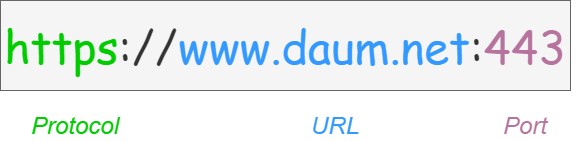
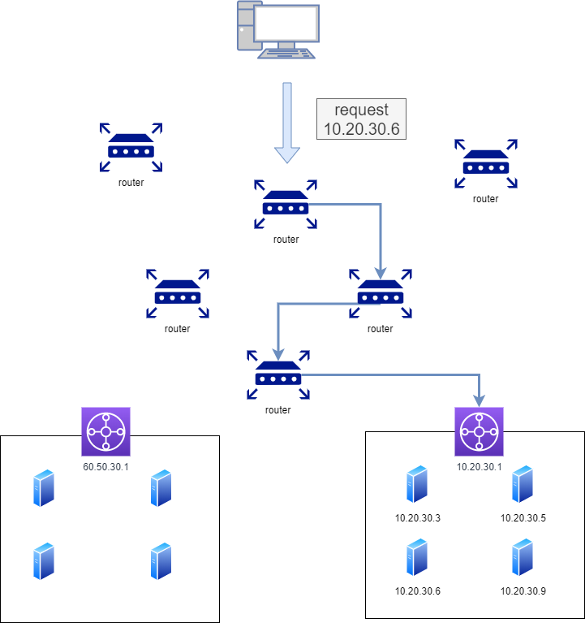
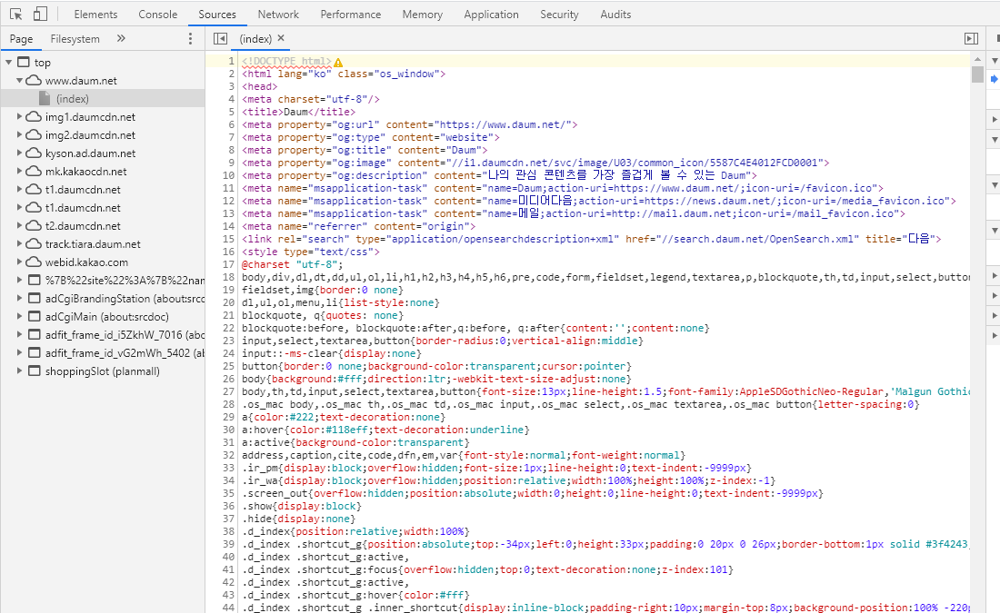

## 01/09 브라우저에서 구글(서버 응답)까지 흐름 

### 1. 브라우저의 URL 파싱

URL을 입력 받은 브라우저는 일단 이 URL의 구조를 해석, 어떤 포트로 보낼지 해석하게 된다. 기본적인 URL의 구조는 아래와 같다

- 어떤 프로토콜을 통해 해당 URL에 요청할 것인지
- 어떤 URL로 요청할 것인지
- 어떤 포트로 요청할 것인지

브라우저에서 각각 프로토콜, URL, 포트를 해석하여 분석합니다.

명시적으로 포트를 선언하지 않았다면 브라우저에서는 설정된 기본값을 이용해 요청하게 됩니다. HTTP라면 80 포트를, HTTPS라면 443 포트를 기본 값으로 요청하게 된다.

### 2. HSTS 목록 조회

HSTS(HTTP Strict transport security), HTTP를 허용하지 않고 HTTPS를 사용하는 연결만 허용하는 기능입니다. 만약 HTTP로 요청이 왔다면 HTTP응답 헤더에 "Strict Transport Security" 라는 필드를 포함하여 응답하고 이를 확인한 브라우저는 해당 서버에 요청할 때 HTTPS만을 통해 통신하게 됩니다. 그리고 자신의 HSTS 캐시에 해당 URL을 저장하는데 이를 HSTS 목록이라고 부릅니다.

이를 통해 브라우저에서는 이 HSTS 목록 조회를 통해 해당 요청을 HTTPS로 보낼지 판단합니다. HSTS목록에 해당 URL이 존재한다면 명시적으로 HTTP를 통해 요청한다 해도 브라우저가 이를 HTTPS로 요청합니다.

### 3. URL을 IP 주소로 변환

[www.google.com](https://steady-turtle10000.tistory.com/manage/newpost/www.google.com) 이라는 주소로는 컴퓨터 끼리 통신할 수 없습니다. 이를 인터넷 상에서 컴퓨터가 읽을 수 있는 IP주소로 변환해야 서로 통신이 가능하게 됩니다. 우선 브라우저에서는 자신의 로컬 hosts 파일과 브라우저 캐시에 해당 URL이 존재하는지 확인합니다. 존재하지 않는 다면 도메인 주소를 IP주소로 변환해주는 DNS(Domain Name System) 서버에 요청하여 해당 URL을 IP 주소롤 변환합니다.

#### DNS 서버로 요청하는 과정

1. 미리 설정된 Local DNS에 해당 URL 주소의 IP주소를 요청합니다.
2. Local DNS에 해당 IP 주소가 존재한다면 이를 응답하고, 없다면 다른 DNS 서버와 통신합니다. root DNS 서버에 해당 URL의 IP주소를 요청합니다.
3. root DNS서버에 해당 IP주소가 없다면 하위 DNS 서버에 요청하라고 응답합니다. 이 응답을 받은 Local DNS는 . net 도메인을 관리하는 DNS 서버에 같은 내용을 요청합니다.
4. .net DNS 서버에 해당 IP주소가 없다면 하위 DNS 서버에 요청하라고 응답합니다. 이 응답을 받은 Local DNS는 daum.net 도메인을 관리하는 DNS 서버에 같은 내용을 요청합니다.
5. daum.net DNS 서버에서 IP주소를 응답받은 Local DNS는 해당 IP주소를 캐싱하고 응답합니다.

### 4. 라우터를 통해 해당 서버의 게이트웨이까지 이동

DNS 서버에게 IP주소를 받았으니 이제 해당 서보로 요청을 보냅니다. 요청을 보낼 IP주소를 임의로 10.20.30.6 이라고 가정하겠습니다. 이 IP 주소로 가야 하는 것은 알지만 어떻게 가야 할지 경로는 알 수 없습니다. 이 요청이 네트워크를 타고 어떻게 이동할지는 네트워크 장비인 라우터의 라우팅을 통해 이루어 집니다.

라우터에서는 라우팅 테이블을 통해 해당 요청이 어떤 경로를 통해 가야할지 경로를 지정해줍니다. 이를 통해 요청은 10.20.30.6 를 찾아갑니다.

### 5. ARP를 통해 IP 주소를 MAC 주소로 변환

실질적인 통신을 하기 위해서는 논리 주소인 IP주소를 물리 주소인 MAC 주소로 변환해야 합니다. 이를 위해 해당 네트워크 내에서 ARP를 브로드 캐스팅합니다. 해당 IP주소를 가지고 있는 노드는 자신의 MAC 주소를 응답합니다.

### 6. 대상 서버와 TCP 소켓 연결

이제 대상 서버와 통신하기 위해 TCP 소켓 연결을 진행합니다. 소켓 연결은 3-way-handshake라는 과정을 통해 이루어집니다. 이 과정은 마치 전화를 거는 것과 유사합니다. 서버에게 전화를 걸고, 서버는 해당 전화를 확인하고 전화를 건 사람은 요청합니다.

하지만 지금 하는 요청은 HTTPS 요청입니다. 그렇기 때문에 서로 암호와 통신을 위한 TLS 핸드쉐이킹이 추가됩니다. 이를 통해 서버와 클라이언트는 암호화 통신을 진행할 수 있습니다.

### 7. HTTP(HTTPS) 프로토콜로 요청, 응답

이제 연결이 확정 되었으니 드디어 해당 페이지 www. google.com 을 달라고 서버에게 요청합니다.

서버에게 해당 요청을 받고 , 이 요청을 수락할 수 있는지 검사합니다. 그리고 서버는 이 요청에 대한 응답을 생성하여 브라우저에게 전달합니다.

### 8. 브라우저에서 응답을 해석

서버에서 응답한 내용은 HTML, CSS, Javascript 등으로 이루어져 있습니다. 이를 테면 아래와 같이 우리가 웹 페이지라고 인식하기 어려운 문자들로 구성되어 있습니다.

이를 브라우저에서 해석하여 그려줍니다. 각종 텍스트를 정해진 형식으로 해석하여 우리가 원하는 [www.google.com](https://steady-turtle10000.tistory.com/manage/newpost/www.google.com) 페이지가 그려집니다.
