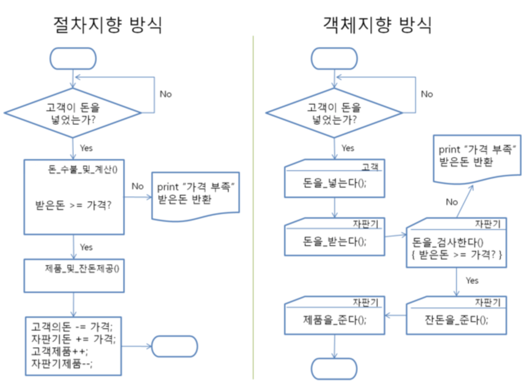

## 12/27 27일 객체 지향 프로그래밍 ,절차 지향 프로그래밍 정리 및 차이점,

### 절차 지향(Procedural Programming)이란?

절차 지향 프로그래밍이란 물이 위에서 아래로 흐르는 것처럼 순차적인 처리가 중요시 되며, 프로그램 전체가 유기적으로 연결되도록 만드는 프로그래밍 기법입니다. 대표적인 절차지향 언어에는 C언어가 있습니다. 절차 지향 프로그래밍은 컴퓨터의 작업 처리 방식과 유사하기 때문에 객체 지향 언어보다  하드웨어 적으로 빠르게 처리 됩니다. 옛날에는 하드웨어와 소프트웨어의 개발 속도차이가 크지 않았습니다. 하지만 하드웨어의 기술적인 발전으로 통해 컴퓨팅 환경은 급속도로 증가했지만 소프트웨어 개발 시간이 따라가지 못하게 되고 이런  상황에서 소프트웨어의 개발시간을 단축하되 하드웨어에 기본적인 사양을 잡아먹어도 더 이상 큰 단점이 아니기에 모듈화, 캡슐화해서 개념적으로 접근하는 형태를 갖는 객체지향 프로그래밍이 탄생했습니다. 객체지향 프로그래밍은 개발하려는 것을 기능별로 묶어 모듈화를 함으로서 같은 기능을 중복으로 연산하지 않거나 모듈을 재활용하기 때문에 유지 보수에 유리합니다. 

-  장점
  - 컴퓨터의 처리구조와 유사해 실행속도가 빠름
- 단점
  - 유지 보수가 어려움
  - 실행 순서가 정해져 있으므로 코드의 순서가 바뀌면 동일한 결과를 보장하기 어려움
  - 디버깅이 어려움

### 객체지향(Object Oriented Programming) 이란?

객체지향의 정의를 살펴보면 객체지향이란 실제 세계를 모델링하며 소프트웨어를 개발하는 방법입니다. 객체 지향 프로그래밍에서는 데이터와 절차를 하나의 덩어리로 묶어서 생각하게 됩니다.  객체 지향의 3대 특성은 다음과 같습니다.

- 캡슐화
  - 캡슐화란 관련된 데이터와 알고리즘(코드)이 하나의 묶음으로 정리된 것으로서, 관련된 코드와 데이터가 묶여있고 오류가 없어 사용이 편리합니다. 데이터를 감추고 외부와의 상호작용은 메소드를 통하는 방법으로, 라이브러리를 통해 쉽게 업그레이드가 가능합니다.
  - 메소드 : 메시지에 따라 실행시킬 프로시저로서 객체 지향 언어에서 사용되는 것. 객체 지향 언어에서는 메시지를 보내 메소드 를 수행 시킴으로서 통신을 수행
- 상속
  - 상속은 이미 작성된 클래스를 이어 받아서 새로운 클래스를 생성하는 기법으로 위에서 말한 기존 코드를 재활용해서 사용하는 것을 의미합니다. 객체 지향 방법의 큰 장점중 하나입니다.
- 다형성
  - 다형성이란 하나의 이름(방법)으로 많은 상황에 대처하는 기법입니다. 개념적으로 동일한 작업을 하는 함수들에 똑같은 이름을 부여할 수 있으므로 코드가 더 간단해지는 효과가 있습니다.

객체 지향 언어는 어떤 모듈에 있는 하나의 기능만 필요하더라도 모듈 전체를 가져와야 하기 때문에 절차지향 프로그래밍보다 프로그램 사이즈가 더 커질 수도 있습니다. 또한 데이터에 대한 접근도 상대적으로 절차지향식보다 느려질 가능성이 많습니다. 메소드를 통해서만 접근이 가능하기 때문에 절차 지향식처럼 특정 함수에 접근할 수 없고, 식으로만 접근이 가능해 속도적인 측면에서 불이익이 있습니다. 

- 장점
  - 신뢰성 있는 소프트웨어를 쉽게 작성할 수 있다(개발자가 만든 데이터를 사용하기에 신뢰 가능)
  - 코드의 재활용성이 높다
  - 코딩이 절차 지향보다 간편함
  - 디벙깅 및 업그레이드 간편
- 단점
  - 처리속도가 절차지향보다 느림
  - 설계에 많은 시간소요가 들어감

### 객체 지향과 절차 지향의 차이점

객체 지향의 반대는 절차 지향이 아니고 절차 지향의 반대는 객체 지향이 아닙니다.  절차 지향은 순차적으로 실행에 초점이 되어 있고 객체 지향은 객체간의 관계/조직에 초점을 두고 있습니다. 

절차 지향은 데이터를 중심으로 함수를 구현합니다. 이에 반해 객체 지향은 기능을 중심으로 메서드를 구현하게 됩니다.
