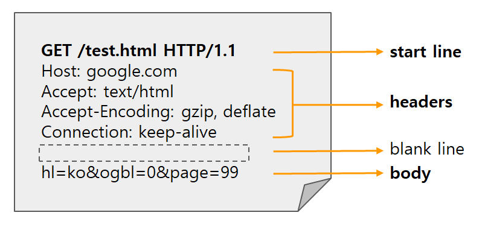
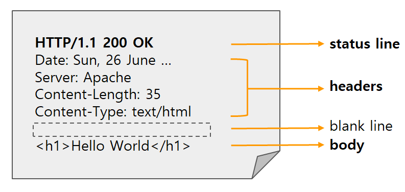

## 12/28 HTTP? HTTPS?

### HTTP Request/Response 구조

#### HTTP(Hyper Text Transfer Protocol)

- 하이퍼텍스트(HTML) 문서를 교환하기 위해 만들어진 protocol(통신 규약).

- 즉 웹상에서 네트워크로 서버끼리 통신을 할때 어떠한 형식으로 서로 통신을 하자고 규정해 놓은 "통신 형식" 혹은 "통신 구조"라고 보면 된다.

  프론트앤드 서버와 클라이어트간의 통신에 사용된다.

  또한 백앤드와 프론트앤드 서버간에의 통신에도 사용된다.

- HTTP는 TCP/IP 기반으로 되어있다.

- HTTP는 기본적으로 request(요청)/response(응답) 구조로 되어있다.

  클라이언트가 HTTP request를 서버에 보내면 서버는 HTTP response를 보내는 구조

  클라이언트와 서버의 모든 통신이 요청과 응답으로 이루어 진다.


#### Request Message

HTTP Request Message는 공백(blank line)을 제외하고 3가지 부분으로 나누어진다.

HTTP Request Message 구조

- Start Line
- Headers
- Body



#### start line

HTTP Request Message의 시작 라인

HTTP request의 start line 3가지 부분으로 구성

- HTTP method
- Request target
- HTTP version

```python
GET /test.html HTTP/1.1
[HTTP Method] [Request target] [HTTP version]
```

- `HTTP Method`는 요청의 의도를 담고 있는 GET, POST, PUT, DELETE등이 있습니다. GET은 존재하는 자원에 대한 요청, POST는 새로운 자원을 생성, PUT은 존재하는 자원에 대한 변경, DELETE는 존재하는 자원에 대한 삭제와 같은 기능을 가지고 있습니다.
- `Request target`은 HTTP Request가 전송되는 목표 주소입니다.
- `HTTP version`은 version에 따라 Request 메시지 구조나 데이터가 다를 수 있어서 version을 명시합니다.

#### headers

해당 request에 대한 추가 정보(addtional infomation)를 담고 있는 부분

예를 들어, request 메세지 body의 총 길이 (Content-Length)등 Key:Value 형태로 구성

headers도 크게 3가지 부분으로 나뉨(general headers, request headers, entity headers)

```python
Host: google.com
Accept: text/html
Accept-Encoding: gzip, deflate
Connection: keep-alive
...
```

- `Host` 요청하려는 서버 호스트 이름과 포트번호
- `User-agent` 클라이언트 프로그램 정보. 이 정보를 통해 서버는 클라이언트 프로그램(브라우저)에 맞는 최적의 데이터를 보내줄 수 있다.
- `Referer` 바로 직전에 머물렀던 웹 링크 주소
- `Accept` 클라이언트가 처리 가능한 미디어 타입 종류 나열
- `If-Modified-Since` 여기에 쓰여진 시간 이후로 변경된 리소스 취득. 페이지가 수정되었으면 최신 페이지로 교체한다.
- `Authorization` 인증 토큰을 서버로 보낼 때 쓰이는 Header
- `Origin` 서버로 Post 요청을 보낼 때 요청이 어느 주소에 시작되었는지 나타내는 값. 이 값으로 요청을 보낸 주소와  받는 주소가 다르면 CORS(Cross-Origin Resource Sharing)에러가 발생한다.
- `Cookie`  쿠키 값이 Key-value로 표현된다.


#### body

HTTP Request가 전송하는 데이터를 담고 있는 부분

전송하는 데이터가 없다면 body 부분은 비어있습니다.

보통 post 요청일 경우, HTML 폼 데이터가 포함되어 있습니다.

```python
POST /test HTTP/1.1

Accept: application/json
Accept-Encoding: gzip, deflate
Connection: keep-alive
Content-Length: 83
Content-Type: application/json
Host: google.com
User-Agent: HTTPie/0.9.3

{
    "test_id": "tmp_1234567",
    "order_id": "8237352"
}
```


#### Response Message

HTTP Response Message는 request와 동일하게 공백(blank line)을 제외하고 3가지 부분으로 나누어진다.

- Status Line

- Headers

- Body

  

#### status line

HTTP Response의 상태를 간략하게 나타내주는 부분

HTTP Response의 status line또한 3가지 부분으로 구성

- HTTP version
- Status Code
- Status Text

```python
HTTP/1.1 200 OK
[HTTP version] [Status Code] [Status Text]
```

#### headers

Response의 headers와 동일하다.

다만 response에서만 사용되는 header 값들이 있다.

예를 들어, User-Agent 대신에 Server 헤더가 사용된다.

#### body

Response의 body와 일반적으로 동일하다.

Request와 마찬가지로 모든 response가 body가 있지는 않다.

데이터를 전송할 필요가 없을경우 body가 비어있게 된다.


### HTTPS

HTTP는 기본적으로 클라이언트와 서버사이에서 데이터를 주고받는 통신 프로토콜이다. 그러나  HTTP에는 단점이 존재했는데 주고 받는 데이터가 전송될 때 암호화되지 않기 때문에 보안에 취약하다는 것이다. 이러한 문제를 해결하기 위해 중요한 정보를 주고 받을 때 도난당하는 것을 막게 하는 프로토콜이 생성되었다. 이를 HTTPS라고 한다. 기존의 HTTP를 암호화한 버전이 HTTPS가 된 것이다. SSL(Secure Socket Layer)이라는 프로토콜을 사용해 주고 받는 정보를 암호화한다. 이후 SSL은 TLS (Transport Layer Security)로 발전되어 현재는 SSL/TLS라는 단어를 혼용해서 사용하고 있다.
