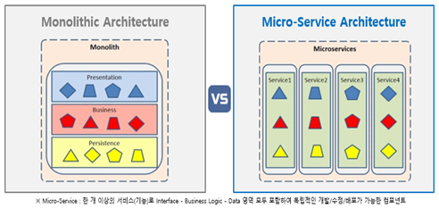

## 12/29 MSA

### MSA 란?

마이크로 서비스 아키텍쳐를 한마디로 다음과 같이 표현할 수 있습니다.

> 하나의 큰 어플리케이션을 여러개의 작은 어플리케이션으로 쪼개어 변경과 조합이 가능하도록 만든 아키텍쳐

마이크로 서비스 아키텍쳐에 대한 정확한 정의는 아직 없습니다. 하지만 마이크로서비스란 작고, 독립적으로 배포 가능한 각각의 기능을 수행하는 서비스로 구성된 프레임워크라고 할 수 있습니다. 마이크로서비스는 완전히 독집적으로 배포가 가능하고, 다른 기술 스택(개발 언어, 데이터베이스 등) 이 사용 가능한 단일 사업 영역에 초점을 두고 있습니다.

### MSA 등장배경

#### Monolithic Architecture

Monolithic Architecture란, 소프트웨어의 모든 구성요소가 한 프로젝트에 통합되어있는 형태입니다. 웹 개발을 예로 들면 웹 프로그램을 개발하기 위해 모듈별로 개발을 하고, 개발이 완료된 웹 어플리케이션을 하나의 결과물로 패키징하여 배포되는 형태를 말합니다.  아직까지는 많은 소프트웨어가 Monolithic 형태로 구현되어 있고, 소규모 프로젝트에는 Monolithic Architecture가 훨씬 합리적입니다. 간단한 Architecture이고, 유지보수가 용이하기 때문이죠. 하지만 일정 규모 이상의 서비스, 혹은 수백명의 개발자가 투입되는 프로젝트에서 Monolithic Architecture은 뚜렷한 한계를 보입니다.

- 서비스/프로젝트가 커지면 커질수록, 영향도 파악 및 전체 시스템 구조의 파악에 어려움이 있습니다.
- 빌드 시간 및 테스트시간, 그리고 배포시간이 기하급수적으로 늘어나게 됩니다.
- 서비스를 부분적으로 scale-out하기가 힘듭니다.
- 부분의 장애가 전체 서비스의 장애로 이어지는 경우가 발생하게됩니다.

이러한 Monolithic Architecture의 문제점들을 보완하기 위해 MSA가 등장하게 되었습니다. 기존의 특정한 물리적인 서버에 서비스를 올리던 on-promise 서버 기반의 Monolithic Architecture에서 이제는 클라우드 환경을 이용하여 서버를 구성하는 MicroService Architecture로 많은 서비스들이 전환되고 있습니다.

 ### MSA 특징

👉  MSA는 API를 통해서만 상호작용할 수 있다. 즉, 마이크로 서비스는 서비스의 end-point(접근점)을 API 형태로 외부에 노출하고, 실질적인 세부 사항은 모두 추상화한다. 내부의 구현 로직, 아키텍처와 프로그래밍 언어, 데이터베이스, 품질 유지 체계와 같은 기술적인 사항들은 서비스 API에 의해 철저하게 가려진다.

 

- 제대로 설계 된 마이크로서비스는 하나의 비즈니스 범위에 맞춰 만들어지므로 하나의 기능만 수행한다. 즉, 어플리케이션 출시처럼 하나의 목표를 향해 일하지만 자기가 개발하는 서비스만 책임진다. 그리고 여러 어플리케이션에서 재사용 할 수 있어야 한다.
- 어플리케이션은 항상 기술 중립적 프로토콜을 사용해 통신하므로 서비스 구현 기술과는 무관하다. 따라서 마이크로서비스 기반의 어플리케이션을 다양한 언어와 기술로 구출할 수 있다는 것을 의미한다.
- 마이크로서비스는 SOA에서 사용되는 집중화된 관리 체계를 사용하지 않는다. 마이크로서비스 구현체의 공통적인 특징 중 하나는 ESB(Enterprise Service Bus)와 같은 무거운 제품에 의존하지 않는다는 점이다. REST 등 가벼운 통신 아키텍처, 또는 Kafka 등을 이용한 message stream을 주로 사용한다. 

### MSA의 장점

- 각각의 서비스는 모듈화가 되어있으며 이러한 모듈끼리는 RPC 또는 message-driven API등을 이용하여 통신한다. 이러한 MSA는 각각 개별의 서비스 개발을 빠르게 하며, 유지보수도 쉽게할 수 있도록 한다.
- 팀 단위로 적절한 수준에서 기술 스택을 다르게 가져갈 수 있다. 회사가 java의 spring 기반이라도 MSA를 적용하면 node.js로 블록체인 개발 모율을 연동함에 무리가 없다.
- 마이크로 서비스는 서비스별로 독집적 배포가 가능하다. 따라서 지속적인 배포 CD도 모놀로식에 비해서 가벽게 할 수 있다.
- 마이크로서비스는 각각 서비스의 부하에 따라 개별적으로 scale-out이 가능하다. 메모리, CPU적으로 상당부분 이득이 된다.

### MSA의 단점

- MSA는 모놀리식에 비해 상대적으로 많이 복잡하다. 서비스가 모두 분산되어 있기 때문에 개발 자는 내부 시스템의 통신을 어떻게 가져가야 할지 정해야 한다. 또한, 통신의 장애와 서버의 부하등이 있을 경우 어떻게 transaction을 유지할지 결정하고 구현해야한다.

- 모놀리식에서는 단일 트랜잭션을 유지하면 되었지만, MSA에서는 비즈니스에 대한 DB를 가지고 있는 서비스도 각기 다르고, 서비스의 연결을 위해서는 통신이 포함되기 때문에 트랜잭션을 유지하는게 어렵다

- 통합 테스트가 어렵다. 개발 환경과 실제 운영환경을 동일하게 가져가는 것이 쉽지 않다.

- 실제 운영환경에 대해서 배포하는 것이 쉽지 않다 마이크로서비스의 경우 서비스 1개를 재배포 한다고 하면 다른 서비스들과의 연계가 정상적으로 이루어지고 있는지도 확인해야 한다.

  

