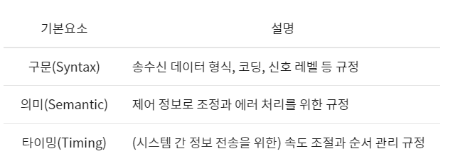
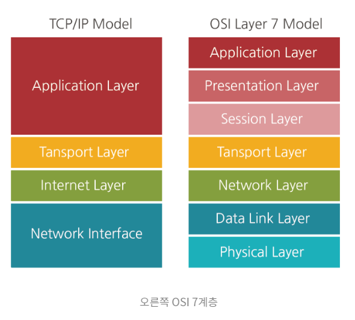
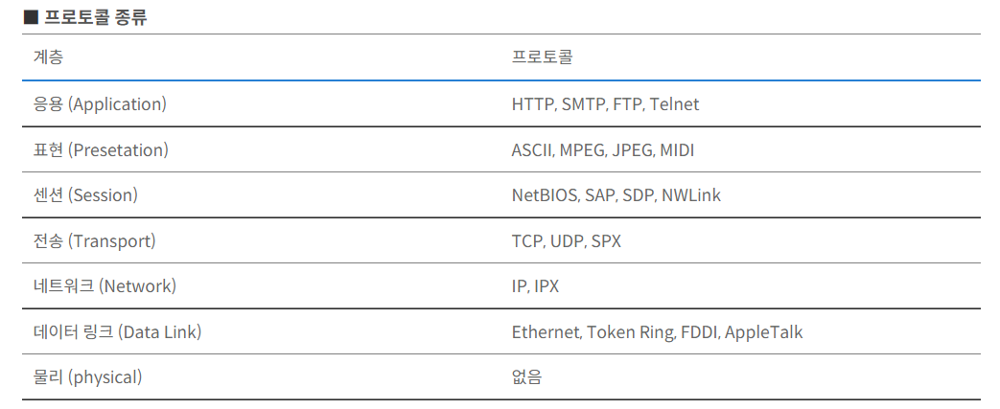

## 12/29 프로토콜(protocol)

### 프로토콜이란?

> 서로 다른 시스템 및 기기 간 데이터 교환을 원활히 하기 위한 표준화된 통신 규약

기기 간 통신은 교환되는 데이터 형식에 대해 상호 협의를 요구하기 때문에 프로토콜이 필요한 것이며, 공통의 데이터 교환 방법이나 순서에 대해 정의한 약속, 규칙 체계를 의미한다. 따라서 동일한 프로토콜을 사용하면 기종 및 프로그램이 다르더라도 컴퓨터간 상호 통신이 가능하다. 따라서 다른 기종간 정보 통신을 하기 위해 표준 프로토콜을 채택하여 통신망을 구축해야 한다.

### 프로토콜의 기본요소

> 기본 요소는 크게 구문, 의미, 타이밍 세 가지가 있다

### 프로토콜의 기능

#### 단편화(Fragmentation) 와 재합성(Assembly)

- 단편화 : 송신 측에서는 긴 데이터 블록을 손쉽게 전송할 수 있도록 크기가 똑같은 작은 블록으로 나누어 전송
- 재합성 : 수신 측에서 쪼개진 작은 데이터 블록을 재합성하여 원래의 메시지로 복원

#### 캡슐화(Encapsulation)

각 프로토콜에 적합한 데이터 블록을 만들려고 데이터에 정보를 추가하는 것 플래그, 주소 , 제어정보, 유류 검출 부호 등을 부착하는 기능

#### 연결 제어(Connection Control)

비연결 데이터 전송(데이터 그램)과 연결 위주 데이터 전송(가상회선)을 위한 통신로는 개설, 유지, 종결하는 기능

#### 흐름 제어(Flow Control)

데이터양이나 통신속도 등이 수신 측의 처리 능력을 초과하지 않도록 조정하는 기능

#### 오류 제어(Error Control)

데이터 전송 중 발생할 수 있는 오류나 착오 등을 검출하고 정정하는 기능

#### 순서 결정(Sequencing)

연결 위주의 데이터를 전송할 때 송신 측이 보내는 데이터 단위 순서대로 수신 측에 전달하는 기능

#### 주소 설정(Addressing)

발생지, 목적지 등의 주소를 명기하여 데이터를 정확하게 전달하는 기능

#### 동기화(Synchronization)

두 통신 객체의 상태(시작, 종류, 검사 등)를 일치시키는 기능

#### 다중화(Multiplexing)

하나의 통신로를 여러 개로 나누거나 회선 여러 개를 하나의 통신로로 변환시켜 다수의 가입자가 동시에 사할 수 있도록 하는 기능

#### 전송 서비스(Transmission Service)

통신 객체를 사용하기 쉽도록 별도로 추가 서비스(패리티 검사,  보안도,  서비스 등급, 우선 수위 등)를 제공하는 기능

### 프로토콜 계층 구성

> 프로토콜 계층은 기본적으로 데이터 전송제어에 관한 계층, 통신 처리에 관한 계층으로 나뉜다. 세계적으로 프로토콜 표준화가 시도됐고, 가장 대표적인 것은 국제 표준화기구 ISO에서 정한 OSI 7 계층이다.

- OSI 7계층
  - 물리, 데이터링크, 네트워크, 트랜스포트, 세션, 프레젠테이션,  응용 계층으로 정의되어 있다. 각 계층은 서로 독립적으로 구성되어 있으며 하위 계층의 기능을 이용해 상위 계층에 기능을 제공한다.

### 통신 프로토콜(=네트워크 프로토콜)

> 통신 프로토콜은 컴퓨터나 원거리 통신 장비 사이에서 메시지를 주고 받는 양식와 규칙의 체계

프로토콜의 종류들 중 통신 프로토콜이 가장 주요한 개념이다. 프로토콜을 통해 정할 수 있는 내용에 는 전달 방식, 통신 방식, 자료의 형식, 오류 검증 방식,  코드 변환 규칙, 전송 속도 등이 있다. 통신 프로토콜에는 여러 종류가 있지만 그중 TCP/IP가 대표적이다

#### TCP

TCP는 전송 제어 프로토콜, 전송 계층에 위치하며 근거리 통신망이나 인트라넷, 인터넷에 연결된 컴퓨터에서 실행되는 프로그램 간에 일련의 옥텟(octet)을 안정적으로, 순서대로 또 에러 없이 교환할 수 있게 해주는 프로토콜이다.

#### IP

인터넷 프로토콜(IP, Internet Protocol)은 송신 호스트와 수신 호스트가 패킷(packet) 교환 네트워크에서 정보를 주고받는데 사용하는 정보 위주의 프로토콜이며, OSI 네트워크 계층에서 호스트의 주소지정과 패킷 분활 및 조립 기능을 담당한다. 줄여서 아이피(IP)라고도 한다.

> 참조 

`octet`:  **컴퓨팅에서 8개의 비트가 한데 모인 것을 말한다**. 초기 컴퓨터들은 1 바이트가 꼭 8 비트만을 의미하지 않았으므로, 8비트를 명확하게 정의하기 위해 옥텟이라는 용어가 필요했던 것이다.

`packet`:  **정보 기술에서 패킷 방식의 컴퓨터 네트워크가 전달하는 데이터의 형식화된 블록**이다. 패킷은 제어 정보와 사용자 데이터로 이루어지며, 이는 페이로드라고도 한다.

12/29일 프로그래밍 CS문제: 동기와 비동기 차이

네트워크 : OSI 7계층 CS문제: 동기와 비동기 차이
