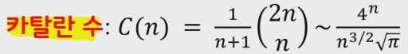

## 다이나믹 프로그래밍

- 다이나믹 프로그래밍은 메모리를 적절히 사용하여 수행 시간 효율성을 비약적으로 향상시키는 방법입니다.
- 이이 계산된 결과(작은 문제)는 별도의 메모리 영역에 저장하여 다시 계산하지 않도록 합니다.
- 다이나믹 프로그래밍의 구현은 일반적으로 두 가지 방식(탑다운과 바텀업)으로 구성됩니다.


##### 다이나믹 프로그래밍은 동적 계획법이라고도 부릅니다.

- 일반적인 프로그래밍 분야에서의 동적(Dynamic)이란 어떤 의미를 가질까요?
  - 자료구조에서 동적 할당(Dynamic Allocation)은 '프로그램이 실행되는 도중에 실행에 필요한 메모리를 할당하는 기법'을 의미합니다.
  - 반면에 다이나믹 프로그래밍에서 '다이나믹'은 별다른 의미 없이 사용된 단어입니다.


- 다이나믹 프로그래밍은 문제가 다음의 조건을 만족할 때 사용할 수 있습니다.
  1. 최적 부분 구조(Optimal Substructure)
     1. 큰 문제를 작은 문제로 나눌 수 있으며 작은 문제의 답을 모아서 큰 문제를 해결 할 수 있습니다.
  2. 중복되는 부분 문제(Overlapping Subproblem)
     1.  동일한 작은 문제를 반복적으로 해결해야 합니다.


#### 피보나치 수열

- 피보나치 수열 다음과 같은 형태의 수열이며, 다이나믹 프로그래밍으로 효과적으로 계산할 수 있습니다.
  - 1,1,2,3,5,8,13,21,34,55,89
- 점확식이란 인접한 항들 사이의 관계식을 의미합니다.
- 피보나치 수열을 점화식으로 표현하면 다음과 같습니다.


##### 피보나치 수열의 시간 복잡도

- 피보나치 수열의 시간복잡도는 다음과 같습니다.
  - 빅오 표기법 : O(2^N)
- 빅오 표기법을 기준으로 f(30)을 계산하기 위해 약 10억가량의 연산을 수행해야 합니다.
- 그렇다면 f(100)을 계산하기 위해 얼마나 많은 연산을 수행해야 할까요?


##### 피보나치 수열(다이나믹 프로그래밍)

- 다이나믹 프로그래밍의 사용 조건을 만족하는지 확인
  1. 최적 부분 구조: 큰 문제를 작은 문제로 나눌 수 있습니다.
  2. 중복되는 부분 문제: 동일한 작은 문제를 반복적으로 해결합니다.
- 피보나치 수열은 다이나믹 프로그램의 사용조건을 만족합니다.


#### 메모이제이션(Memoization)

- 메모이제이션은 다이나믹 프로그래밍을 구현하는 방법 중 하나입니다.
- 한 번 계산한 결과를 메모리 공간에 메모하는 기법입니다.
  - 같은 문제를 다시 호출하면 메모했던 결과를 그대로 가져옵니다.
  - 값을 기록해 놓는다는 점에서 캐싱(Caching)이라고도 합니다.


##### 탑다운 VS 보텀업

- 탑다운(메모이제이션) 방식은 하향식이라고도 하며 바텀업 방식은 상향식이라고도 합니다.

- 다이나믹 프로그래밍의 전형적인 형태는 바텀업 방식입니다.

  - 결과 저장용 리스트는 DP 테이블이라고 부릅니다.

- 엄밀히 말하면 메모이제이션은 이전에 계산된 결과를 일시적으로 기록해 놓는 넓은 개념을 의미합니다.

  - 따라서 메모이제이션은 다이나믹 프로그래밍에 국한된 개념은 아닙니다.
  - 한 번 계산된 결과를 담아 놓기만 하고 다이나믹 프로그래밍을 위해 활용하지 않을 수 도 있습니다.

  

##### 다이나믹 프로그래밍 vs 분할 정복

- 다이나믹 프로그래밍과 분할 정복은 모두 최적 부분 구조를 가질 때 사용할 수 있습니다.
  - 큰 문제를 작은 문제로 나눌 수 있으며 작은 문제의 답을 모아서 큰 문제를 해결할 수 있는 상황
- 다이나믹 프로그래밍과 분할 정복의 차이점은 부분 문제의 중복입니다.
  - 다이나믹 프로그래밍 문제에서는 각 부분 문제들이 서로 영향을 미치며 부분 문제가 중복됩니다.
  - 분할 정복 문제에서는 동일한 부분 문제가 반복적으로 계산 되지 않습니다.


##### 다이나믹 프로그래밍 문제에 접근하는 방법

- 주어진 문제가 다이나믹 프로그래밍 유형임을 파악하는 것이 중요합니다.
- 가장 먼저 그리디, 구현, 완전 탐색, 등의 아이디어로 문제를 해결할 수 있는지 검토 할 수 있습니다.
  - 다른 알고리즘으로 풀이 방법이 떠오르지 않는다면 다이나믹 프로그래밍을 고려해 봅시다.
- 일단 재귀 함수로 비효율적인 완전 탐색 프로그램을 작성한 뒤에 (탑다운) 작은 문제에서 구한 답이 큰 문제에서 그래도 사용될 수 있으면, 코드를 개선하는 방법을 사용할 수 있습니다.
- 일반적인 코딩 테스트 수준에서는 기본 유형의 다이나믹 프로그래밍 문제가 출제되는 경우가 많습니다.


##### DP 기본 문제 (가장 긴 증가하는 수열)

- 백준 18353
- 이 문제의 기본 아이디어는 가장 긴 증가하는 부분 수열(Longest Increasing Subsequence, LIS)로 알려진 전형적인 다이나믹 프로그래밍 문제의 아이디어와 같다
- 예를 들어 하나의 수열 array = [4, 2, 5, 8, 4, 11, 15]가 있다면
  - 이 수열의 가장 긴 증가하는 부분 수열은 [4, 5, 8, 11, 15]입니다.
- 본 문제는 가장 긴 감소하는 부분 수열을 찾는 문제로 치환할 수 있으므로, LIS 알고리즘을 조금 수정하여 적용 함으로서 정답 도출 가능
- 가장 긴 증가하는 수열 (LIS) 알고리즘을 확인 해 봅시다.
- D[i] = array[i]를 마지막 원소로 가지는 부분 수열의 최대 길이
- 점화식은 다음과 같습니다.
  - 모든 0 <= j < i 에 대하여, D[i] = max(D[i], D[j]+1)  if  array[j] < array[i]

##### LIS 기본 코드

```py
import sys
input = sys.stdin.readline

n = int(input())

num_li = list(map(int, input().split()))

# 증가하는 부분 수열 의 수를 저장하기 위한 dp 배열 저장
dp = [1] * n

# 현재의 수까지 증가하는 수 저장
for i in range(1, n):
    # 앞의 수의 배열에서 i 보다 작은수가 있다면 dp에 max값 저장
    for j in range(i):
        if num_li[j] < num_li[i]:
            dp[i] = max(dp[i], dp[j] + 1)

# dp 배열에서 가장 큰수가 가장 긴 증가하는 부분 수열의 수
print(max(dp))

```


##### 최장공통부분 서열 문제(LCS)

- 두개의 문자열 X,Y가 주어졌을 때,
- X와 Y에서 공통으로 나타나는 부분 문자 서열을 찾고자 한다.
- 부분 문자 서열의 길이가 최대가 되도록 부분 문자서열을 찾는 방법은?

##### 단순 무식하게 풀기

- X의 모든 부분 서열 중에서
  - Y의 부분 서열인 것들의 길이를 구한 뒤
  - 이 길이들 중에서 최대값을 착는다.
- X의 모든 부분 서열의 개수는?
  - 지수 시간 복잡도를 가진 알고리즘


##### 동적 계획법으로 풀기

- 메모이제이션(memoization): 이미 계산한 값을 테이블에 저장
- 하향식(top-down) 해법에서 상향식(botom-up)으로 진행


##### LCS 기본 코드

```python
import sys
input = sys.stdin.readline

first_sentence = [' '] + list(input().strip())
second_sentence = [' '] + list(input().strip())

m, n = len(first_sentence), len(second_sentence)

dp = [[0] * n for _ in range(m)]


for j in range(1, m):
    for i in range(1, n):
        if first_sentence[j] != second_sentence[i]:
            dp[j][i] = max(dp[j-1][i], dp[j][i-1])
        
        elif first_sentence[j] == second_sentence[i]:
            dp[j][i] = dp[j-1][i-1] + 1


print(dp[m-1][n-1])
```


### 연쇄 행렬 곱셈

- 주어진 n개의 연쇄 행렬을 곱하는 최적의 순서를 구하시오.
  - n개의 연쇄 행렬 곱셈(A1 * A2* A3* ....... * An)
  - 행렬 곱셈은 결합 법칙이 성립: (Ax * Ay) * Az = Ax *(Ay * Az)
  - 하지만, 행렬 곱셈의 순서에 따라서 각 원소의 곱셈 횟수가 달라짐
  - 각 원소의 곱셈 횟수가 가장 작아지도록 하는 곱셈 순서가 최적의 순서

- 연쇄 행렬 곱셈 문제는 최적화 문제
  - 원소의 곱셈 횟수를 최소화하는 행렬 곱셈의 순서 찾기

- 일반적으로, i * k 행렬과 k * i 행렬을 곱하면 i * j 행렬이 나옴
  - 원소 곱셈의 횟수: i * k * j

- 단순 무식하게 풀어보기
  - 모든 경우의 수에 대해서 계산해 보고 최적의 순서를 선택

- 연쇄 행렬 곱셈에서 가능한 경우의 수는?



- 연쇄 행렬 곱셈이 가지는 경우의 수 = C(n-1)
  - n개의 항에 괄호를 씌우는 모든 경우의 수(n = 1, 2,3, ......)

- 연쇄 행렬 곱셈의 재귀 관계식 구하기

  - 분할정복(Divide-and-Conquer)
  - n개의 행렬을 두 개의 최적 부분행렬의 곱으로 분할

  

#### 배낭 문제와 탐욕 알고리즘

##### 0-1 배낭 문제(0-1 Knapsack Problem)

- 분할이 불가능한 0-1 배낭 문제는 최적화 문제이며
  - 탐욕 알고리즘은 최적해를 보장하지 않는다.

- 0-1 배낭 문제 : 동적 계획법(Dynamic Programming)

```py
 p[i][w]: 총 무게가 w를 초과할 수 없다는 제약조건 하에서 처음 i개 아이템에서만 선택할 때 얻는 최적의 이익
- p[n][w] : n개의 아이템으로 얻을 수 있는 최대 이익 
재귀 관계식
- p[i][w] = {max(p[i-1][w], pi + p[i-1][w-wi]), if wi <= w
            			p[i-1][w], if wi > w}

```

- p 배열의 크기는 nW : 시간 복잡도가 O(nW)
  - 만약 W가 매우 큰 값이라면?
  - 단순 무식으로 푸는 방법은 O(2^n)

- 효율적으로 동적 계획을 사용하려면

```python
- p[n][W]를 계산 하려면 p[n-1][w], p[n-1][w-wn] 만 필요
- p[i][w]를 계산 하려면 p[i-1][w], p[i-1][w-wi] 만 필요
```

##### 0-1 배낭문제 기본 소스 코드

```python

n, k = map(int, input().split())
# 배낭에 배열 순서를 늘려주기 위해 빈 데이터 추가
bag = [(0,0)]

# 점화식을 위한 이차원 배열 array 생성
dp = [[0] * (k+1) for _ in range(n+1)]

for _ in range(n):
    # 가방에 들어갈 무게랑 가치 설정
    weight, value = map(int, input().split())

    # 가방에 들어갈 물건을 반복해서 넣어주기
    bag.append((weight, value))

# 열은 물건의 순서
for i in range(1, n+1):
    # 행은 무게의 제한을 range로 순차적으로 나열
    for limit in range(1, k+1):
        # 인덱스 별로 물건의 무게, 가치 설정
        weight, value = bag[i]

        # 현재 물건이 현재 인덱스보다 작다면 바로 [이전 물건][같은 무게] dp[i-1][limit]를 입력
        if limit < weight:
            dp[i][limit] = dp[i-1][limit]
        
        # 현재 물건을 넣어준다. 물건을 넣은 뒤의 남은 무게를 채울 수 있는 최대값(dp[i-1][limit-weight]을 위의 행에서 가져와 value에 더해준다)
        # 현재 물건을 넣어주는 것 보다 다른 물건들로 채우는 값 (dp[i-1][limit])을 가져온다
        # 두 물건중에 큰 값이 그 무게의 최대 value (max(dp[i-1][limit], dp[i-1][limit-weight] + value))
        else:
            dp[i][limit] = max(dp[i-1][limit], dp[i-1][limit-weight] + value)

# dp에서 물건의 개수, 만들 수 있는 가치 만큼 데이터 출력
print(dp[n][k])
```

