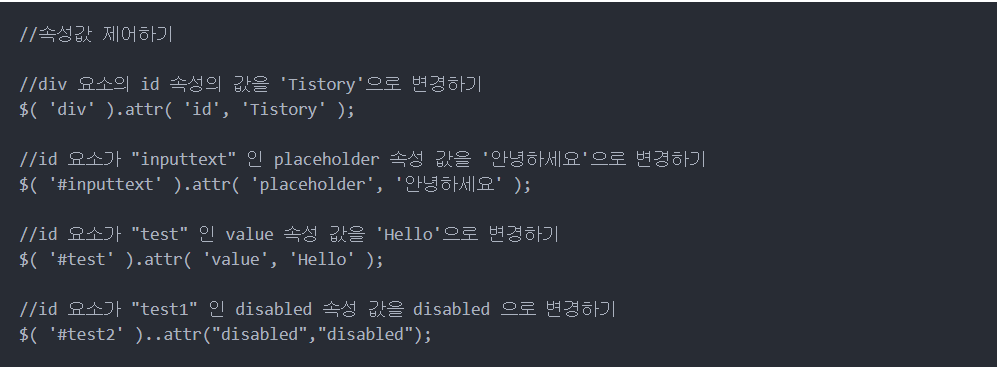

#### Ajax 기본 골격

```javascript
$.ajax({
  type: "GET",
  url: "여기에URL을입력",
  data: {},
  success: function(response){
    console.log(response)
  }
})
```


#### Ajax 코드 해설

```javascript
$.ajax({
  type: "GET", // GET 방식으로 요청한다.
  url: "http://openapi.seoul.go.kr:8088/6d4d776b466c656533356a4b4b5872/json/RealtimeCityAir/1/99",
  data: {}, // 요청하면서 함께 줄 데이터 (GET 요청시엔 비워두세요)
  success: function(response){ // 서버에서 준 결과를 response라는 변수에 담음
    console.log(response) // 서버에서 준 결과를 이용해서 나머지 코드를 작성
  }
})
```


#### jquery (attr)


